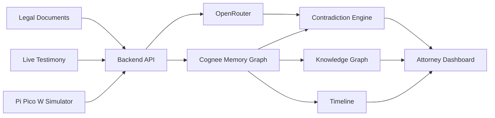
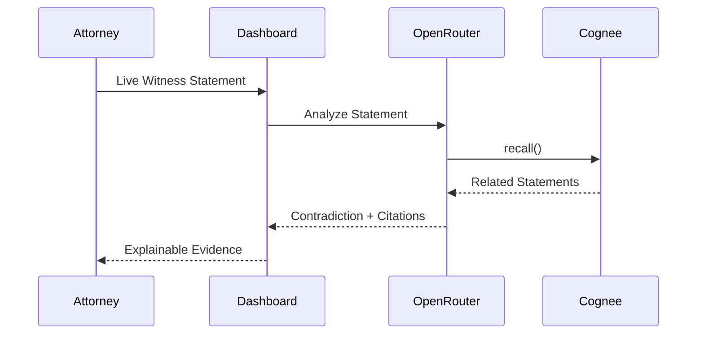
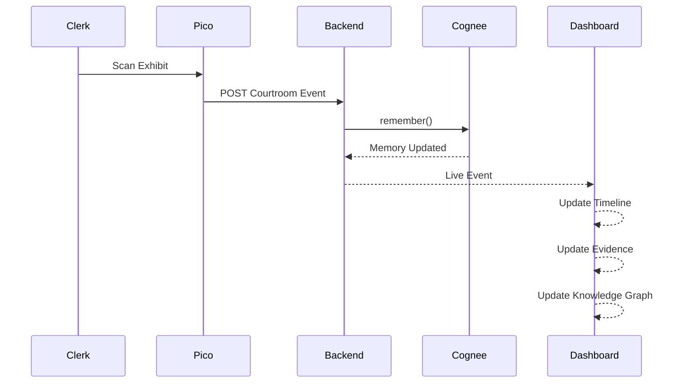

<div align="center">

# ⚖️ CrossLens

### **Your Courtroom Never Forgets.**

AI-powered Courtroom Memory Operating System built for the **Hangover Hackathon** using **Cognee**.

CrossLens transforms thousands of pages of legal documents and live courtroom events into a persistent AI memory graph, enabling real-time contradiction detection, evidence tracking, and explainable legal reasoning.

---


</div>

---

# 🚨 The Problem

During cross-examination, attorneys often have only a few seconds to challenge a witness.

However, important information is buried inside:

- Police Reports
- Depositions
- Previous Hearing Transcripts
- Affidavits
- Expert Reports
- Evidence Logs

Finding contradictions manually takes minutes.

By the time the correct page is located...

**The opportunity is gone.**

---

# 💡 Our Solution

CrossLens acts as a **Courtroom Memory Operating System**.

Instead of searching PDFs, CrossLens remembers the entire case.

It continuously connects:

- Witnesses
- Statements
- Evidence
- Locations
- Timeline
- Courtroom Events

When a witness gives live testimony, CrossLens instantly retrieves relevant prior statements, detects potential contradictions, and provides exact document citations.

---

# ✨ Features

## 🧠 Persistent AI Memory

- Multi-document memory using Cognee
- Entity relationship graph
- Timeline reconstruction
- Long-term contextual recall

---

## ⚠️ Real-time Contradiction Detection

Compare live testimony against:

- Depositions
- Police Reports
- Previous Hearings
- Affidavits

Returns:

- Previous Statement
- Source Document
- Page Number
- Line Number
- Confidence Score
- Reasoning Trail

---

## 📚 Natural Language Q&A

Ask questions like:

> "Who saw Daniel Marshall enter the Blue Lantern Bar?"

CrossLens answers with precise citations.

---

## 📄 Explainable Citations

Every AI response includes:

- Source Document
- Page
- Line Number
- Supporting Evidence

No hallucinations.

---

## 🕸 Knowledge Graph

Visual relationships between:

- Witnesses
- Evidence
- Locations
- Statements
- Timeline

---

## 📅 Timeline Reconstruction

Chronological reconstruction of the entire case.

---

## 📦 Smart Exhibit Tracking

Simulated Raspberry Pi Pico W + RFID system tracks physical courtroom exhibits.

Every exhibit presentation becomes part of the same memory graph.

---

## ⚡ Live Courtroom Events

Real-time activity feed including:

- Witness Sworn
- Exhibit Presented
- Evidence Returned
- Contradictions Found
- Courtroom Timeline

---

# 🧠 How Cognee Powers CrossLens

CrossLens uses **Cognee** as its persistent memory engine.

Instead of treating documents as isolated chunks, Cognee creates a connected memory graph linking:

```
Witness
        │
Statements
        │
Evidence
        │
Locations
        │
Timeline
        │
Documents
```

During live testimony:

1. New statement arrives
2. Cognee recalls related memories
3. Contradictions are identified
4. Source citations are returned
5. Attorney receives explainable results instantly

---

# ⚙️ System Architecture



---

# 🔄 Live Contradiction Flow



---

# 📦 Smart Exhibit Tracking Flow



---

# 🧠 AI Memory Pipeline

```mermaid
flowchart TD

Upload Documents

↓

PDF Parsing

↓

Entity Extraction

↓

Cognee Memory Graph

↓

OpenRouter

↓

Semantic Recall

↓

Contradiction Detection

↓

Citation Generation

↓

Attorney Dashboard
```

---

# 📂 Project Structure

```text
crosslens/

├── frontend/
│   ├── components/
│   ├── pages/
│   ├── layouts/
│   ├── hooks/
│   ├── services/
│   └── assets/
│
├── backend/
│   ├── controllers/
│   ├── routes/
│   ├── services/
│   ├── cognee/
│   ├── openrouter/
│   ├── middleware/
│   └── uploads/
│
├── simulator/
│   ├── wokwi/
│   ├── pico-code/
│   └── diagrams/
│
├── shared/
│
└── README.md
```

---

# 🛠 Tech Stack

### Frontend

- React
- TypeScript
- TailwindCSS
- Vite
- shadcn/ui
- React Flow
- Framer Motion

### Backend

- Node.js
- Express
- TypeScript

### AI

- Cognee
- OpenRouter

### Database

- PostgreSQL
- ChromaDB

### Hardware Simulation

- Raspberry Pi Pico W
- Wokwi
- OLED Display
- RFID Simulation
- Wi-Fi Communication

---

# 🚀 Demo Flow

1. Upload case documents
2. Cognee builds a persistent memory graph
3. Start live witness testimony
4. Simulate an exhibit scan using the Pico W
5. Dashboard updates with courtroom events
6. Witness gives a contradictory statement
7. CrossLens instantly retrieves:
   - Previous testimony
   - Supporting evidence
   - Source citations
   - Reasoning trail

---

# 🔮 Future Roadmap

- Live Speech-to-Text
- Court Reporter Integration
- Multi-case Memory
- AI Cross-Examination Assistant
- Automated Case Brief Generation
- Multi-Courtroom Support
- Real RFID Hardware Integration

---

# 💻 Local Setup

```bash
git clone https://github.com/your-org/crosslens.git

cd crosslens

npm install

npm run dev
```

---

# 👥 Team

Built with ❤️ during the **Hangover Hackathon**.

---

<div align="center">

## ⚖️ CrossLens

**Because the courtroom shouldn't rely on human memory alone.**

</div>
