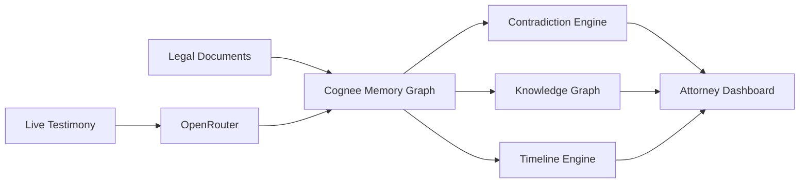
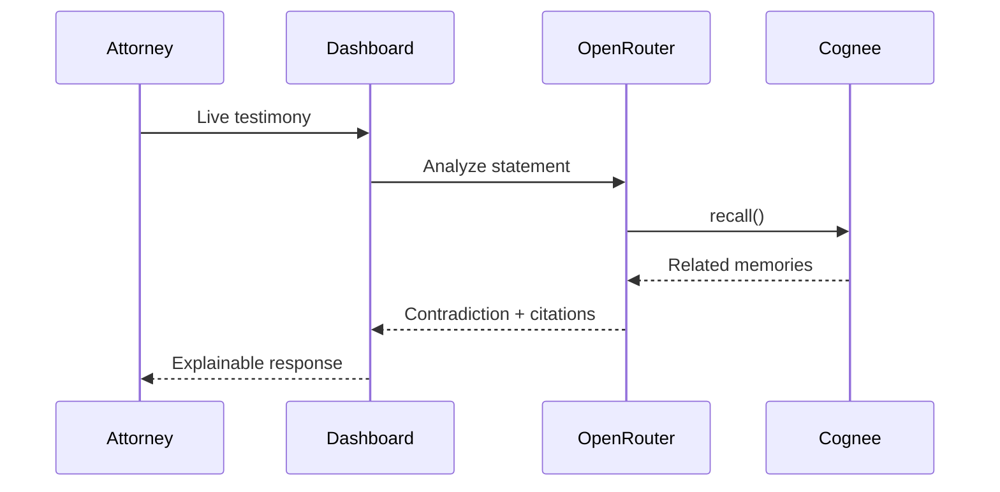
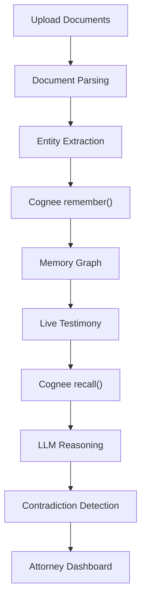

<div align="center">

# CrossLens

### Your Courtroom Never Forgets.

CrossLens is a Courtroom Memory Operating System built for the Hangover Hackathon using Cognee.

It transforms legal documents and courtroom events into a persistent memory graph, enabling real-time contradiction detection, explainable legal reasoning, and evidence-aware retrieval during live witness examination.

</div>

---

## Problem

During cross-examination, attorneys must remember hundreds of pages of:

- Depositions
- Police Reports
- Hearing Transcripts
- Affidavits
- Evidence Logs
- Witness Statements

When a witness contradicts an earlier statement, finding the relevant document and page manually often takes too long, causing valuable impeachment opportunities to be lost.

CrossLens solves this by acting as a persistent courtroom memory system.

---

## Solution

CrossLens continuously remembers the entire case.

Instead of searching documents, attorneys interact with a living memory graph containing:

- Witnesses
- Statements
- Evidence
- Courtroom Events
- Locations
- Timeline

Every response is grounded with citations from the original legal documents.

---

## Core Features

### Persistent Memory

Legal documents are indexed into Cognee to create a connected memory graph.

Supported sources include:

- Depositions
- Police Reports
- Hearing Transcripts
- Affidavits
- Evidence Reports

---

### Live Contradiction Detection

Compare live testimony against previously stored statements.

CrossLens returns:

- Contradicting statement
- Source document
- Page number
- Line number
- Confidence score
- Reasoning trail

---

### Grounded Question Answering

Ask natural language questions such as:

> Who saw Daniel Marshall enter the Blue Lantern Bar?

Every response includes supporting citations.

---

### Knowledge Graph

Interactive visualization connecting:

- Witnesses
- Evidence
- Statements
- Locations
- Timeline
- Documents

---

### Timeline Reconstruction

Chronological reconstruction of case events from ingestion through courtroom proceedings.

---

### Explainable AI

Every contradiction is accompanied by:

- Previous statement
- Supporting evidence
- Source document
- Page reference
- Confidence score

---

### Guided Judge Walkthrough

A built-in guided tour demonstrates the complete CrossLens workflow for judges and evaluators.

---

## How Cognee is Used

Cognee acts as the persistent memory layer of CrossLens.

Instead of storing isolated chunks of text, Cognee builds a structured memory graph connecting entities across multiple legal documents.

CrossLens uses the full memory lifecycle:

- `remember()` — ingest legal documents and courtroom events
- `recall()` — retrieve semantically relevant context during testimony
- `improve()` — refine memory as additional evidence becomes available
- `forget()` — remove obsolete or incorrect information when required

This enables long-term contextual reasoning instead of simple document search.

---

## System Architecture



---

## Live Testimony Flow



---

## Memory Pipeline


## Repository Structure

```text
CrossLens/

├── public/
├── src/
│   ├── assets/
│   ├── components/
│   │   ├── app-sidebar.tsx
│   │   ├── contradiction-card.tsx
│   │   ├── witness-graph.tsx
│   │   ├── case-timeline.tsx
│   │   ├── evidence-panel.tsx
│   │   ├── live-transcript.tsx
│   │   ├── guided-tour.tsx
│   │   └── ui/
│   │
│   ├── hooks/
│   ├── lib/
│   │   ├── api/
│   │   ├── cognee/
│   │   ├── db/
│   │   ├── documents/
│   │   ├── openrouter/
│   │   ├── mock/
│   │   └── types/
│   │
│   ├── routes/
│   │   ├── dashboard.live.tsx
│   │   ├── dashboard.ask.tsx
│   │   ├── dashboard.timeline.tsx
│   │   ├── dashboard.evidence.tsx
│   │   ├── dashboard.contradictions.tsx
│   │   ├── dashboard.memory.tsx
│   │   └── ...
│   │
│   └── scripts/
│
├── package.json
└── README.md
```

---

## Technology Stack

### Frontend

- React
- TypeScript
- TanStack Start
- TanStack Router
- Tailwind CSS v4
- shadcn/ui
- React Flow
- Framer Motion
- Vite

### Backend

- Node.js
- TypeScript
- TanStack Server Functions

### AI

- Cognee
- OpenRouter

### Database

- PostgreSQL

### Document Processing

- Custom document parser
- Entity extraction
- Semantic retrieval

---

## Demo Workflow

1. Upload legal documents.
2. CrossLens extracts entities and stores them in Cognee.
3. A persistent memory graph is created.
4. Live testimony begins.
5. Cognee recalls relevant historical statements.
6. OpenRouter performs contradiction reasoning.
7. CrossLens presents grounded answers with citations.
8. Attorneys use the evidence immediately during cross-examination.

---

## Future Work

- Speech-to-Text integration
- Court reporter integration
- Live courtroom event ingestion
- Raspberry Pi Pico W exhibit tracking
- AI-generated cross-examination suggestions
- Automatic case brief generation

---

## Local Development

```bash
git clone <repository-url>

cd CrossLens

npm install

cp .env.example .env

npm run dev
```

---

## Environment Variables

```env
COGNEE_API_KEY=

OPENROUTER_API_KEY=

DATABASE_URL=

POSTGRES_USER=

POSTGRES_PASSWORD=
```

---

## License

MIT

---

<div align="center">

CrossLens

A courtroom should rely on evidence—not human memory.

</div>
