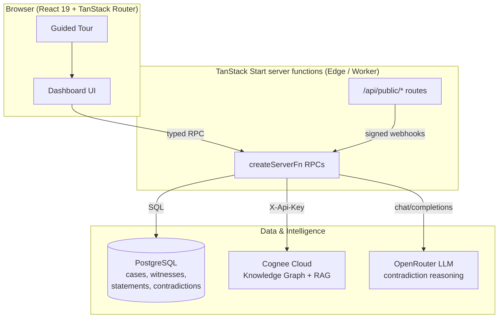
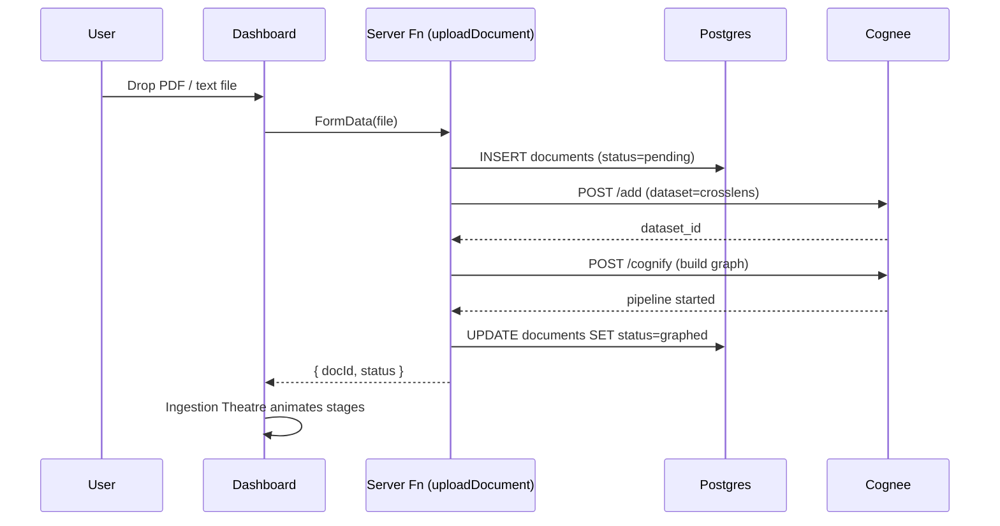
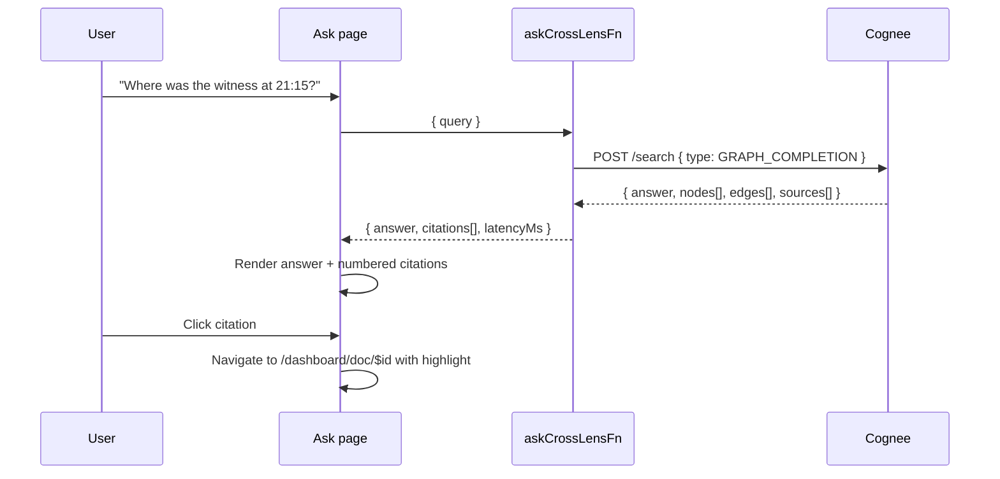
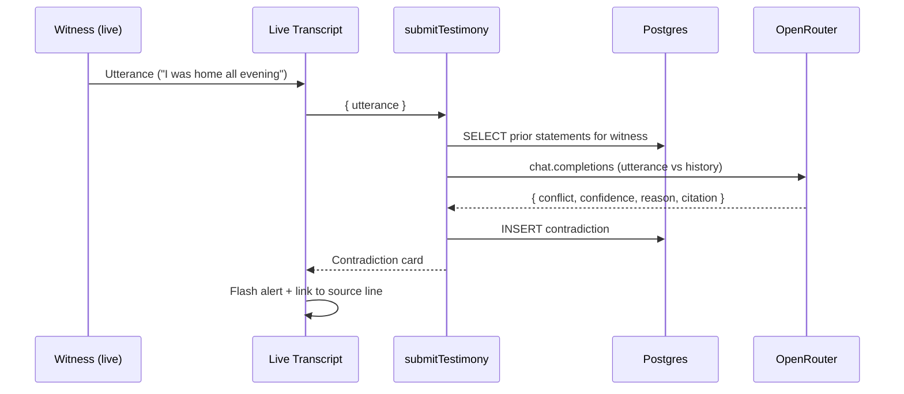

# CrossLens

> **Your Courtroom Never Forgets.**
> An AI-powered courtroom memory platform that ingests case files into a
> knowledge graph, detects contradictions in live testimony, and answers
> natural-language questions with grounded citations.

Built for trial attorneys who cannot afford to miss a prior statement, a
buried exhibit, or a subtle contradiction across weeks of depositions.

---

## Table of contents

1. [What it does](#what-it-does)
2. [Demo journey](#demo-journey)
3. [Architecture](#architecture)
4. [Sequence flows](#sequence-flows)
5. [Tech stack](#tech-stack)
6. [Repository layout](#repository-layout)
7. [Getting started](#getting-started)
8. [Environment variables](#environment-variables)

---

## What it does

| Capability | How it works |
| --- | --- |
| **Ingest case files** | Documents (PDF / text) are stored in Postgres and streamed to Cognee, which parses → chunks → embeds → builds a knowledge graph. |
| **Knowledge graph + timeline** | Entities, witnesses, and events extracted by Cognee are visualised as an interactive graph and chronological timeline. |
| **Ask CrossLens (grounded Q&A)** | Natural-language questions run through Cognee `GRAPH_COMPLETION` search, returning an answer with numbered source citations. |
| **Live contradiction detection** | Each live utterance is compared against every prior statement using an OpenRouter LLM; conflicts are returned with confidence, severity, and grounded citation (document, page, line). |
| **Doc viewer with highlights** | Source documents render inline with extracted entities underlined so the jury exhibit is always one click from the answer. |

---

## Demo journey

The 5-minute judge demo is scripted end-to-end:

1. **Landing** → `Try the Demo` armed with a guided tour.
2. **Case Command Center** → live counts of docs, witnesses, entities, contradictions.
3. **Ingestion Theatre** (`/dashboard/ingest`) → real Cognee documents animated through the pipeline stages *Uploaded → Parsed → Chunked → Embedded → Graphed*.
4. **Knowledge Graph** (`/dashboard/evidence`) and **Timeline** (`/dashboard/timeline`) → rendered from Cognee `INSIGHTS` search.
5. **Contradiction Panel** (`/dashboard/contradictions`) → auto-flagged conflicts between depositions.
6. **Ask CrossLens** (`/dashboard/ask`) → grounded Q&A with citations and processing latency.
7. **Doc viewer** (`/dashboard/doc/$id`) → source document with entity highlights.

Fixture fallbacks are wired into every Cognee call so the demo never stalls on stage if the network flinches.

---

## Architecture



**Key design choices**

- **No vendor lock-in in the app layer.** All server logic lives in
  `createServerFn` RPCs. There are no proprietary edge functions.
- **Cognee owns the knowledge graph.** The app never re-implements graph
  storage or retrieval — it delegates ingest, search, and completion.
- **Postgres owns the case record of truth.** Documents, statements, and
  contradictions are queryable via plain SQL, portable to any provider.
- **OpenRouter is the reasoning layer.** Model choice is a config change,
  not a code change.

---

## Sequence flows

### 1. Document ingestion



### 2. Ask CrossLens (grounded Q&A)



### 3. Live contradiction detection



---

## Tech stack

| Layer | Choice |
| --- | --- |
| Framework | TanStack Start v1 (React 19, SSR, server functions) |
| Build / bundler | Vite 7 |
| Styling | Tailwind CSS v4, shadcn/ui, Framer Motion |
| Data | PostgreSQL via `postgres` driver (Neon-compatible) |
| Knowledge graph / RAG | Cognee Cloud (`/add`, `/cognify`, `/search`) |
| LLM reasoning | OpenRouter |
| 3D visuals | react-three-fiber, drei |
| Graph UI | React Flow |

---

## Repository layout

```
src/
├── routes/                  # File-based routing (TanStack Router)
│   ├── __root.tsx           # App shell (head, providers)
│   ├── index.tsx            # Landing page
│   ├── dashboard.*.tsx      # Case command center, ingest, ask, etc.
│   └── api/public/          # Signed public HTTP endpoints
├── components/              # UI + domain components
│   ├── guided-tour.tsx      # Judge-facing walkthrough
│   ├── witness-graph.tsx    # React Flow graph
│   └── ui/                  # shadcn/ui primitives
├── lib/
│   ├── api/                 # Server functions (createServerFn RPCs)
│   ├── cognee/              # Cognee client + demo layer
│   ├── openrouter/          # LLM client
│   ├── db/                  # Postgres pool, schema, seed
│   └── types/               # Shared TS types
└── styles.css               # Tailwind v4 tokens
```

---

## Getting started

```bash
# 1. Install
bun install

# 2. Configure environment
cp .env.example .env
# fill DATABASE_URL, OPENROUTER_API_KEY, COGNEE_API_KEY, COGNEE_BASE_URL

# 3. Apply schema and seed the demo case
bun run db:apply-schema
bun run db:seed

# 4. Run
bun run dev          # http://localhost:8080
```

Production build:

```bash
bun run build
bun run preview
```

---

## Environment variables

| Variable | Purpose |
| --- | --- |
| `DATABASE_URL` | Postgres connection string (Neon, RDS, local). |
| `COGNEE_API_KEY` | API key for the Cognee tenant. |
| `COGNEE_BASE_URL` | Cognee tenant URL, e.g. `https://tenant-xxx.aws.cognee.ai`. |
| `OPENROUTER_API_KEY` | OpenRouter key for contradiction reasoning. |

---

## License

Prepared for hackathon evaluation. All rights reserved by the CrossLens team.
