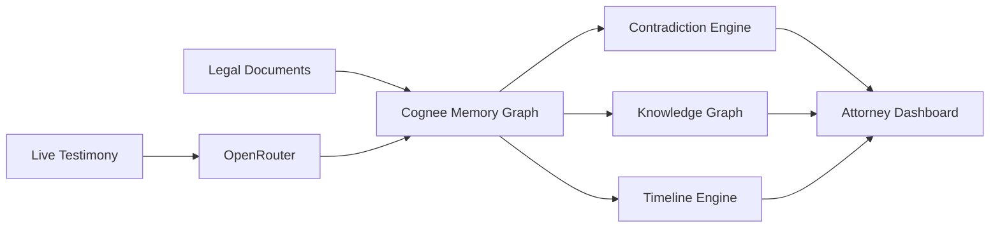
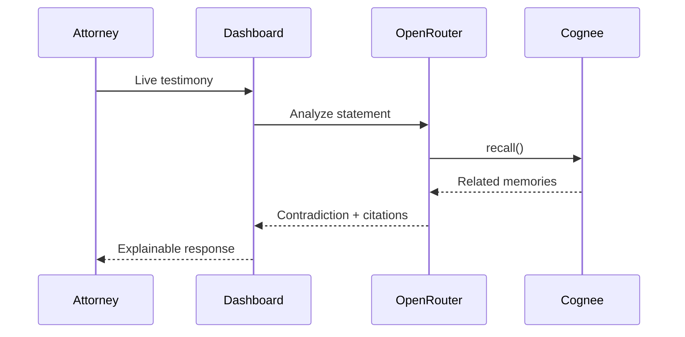
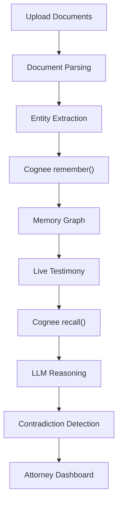

<div align="center">

# CrossLens

### Your Courtroom Never Forgets.

**A Courtroom Memory Operating System, built for the Hangover Hackathon on Cognee.**

CrossLens turns legal documents and live courtroom testimony into a persistent memory graph — enabling real-time contradiction detection, explainable legal reasoning, and evidence-aware retrieval during cross-examination.

[Live Demo](#) · [Demo Video](#) · [How Cognee Is Used](#how-cognee-is-used)

</div>

<table>
<tr>
<td width="50%"></td>
<td width="50%"></td>
</tr>
</table>

---

## Why This Fits the Theme

Attorneys already have "context" — hundreds of pages of it. What they don't have is **memory**: the ability to instantly recall, at the exact moment a witness contradicts themselves, exactly what was said before, where, and how confidently it conflicts. CrossLens is that memory layer — built on Cognee's `remember` → `recall` → `improve` → `forget` lifecycle, not a one-shot document search.

---

## Problem

During cross-examination, attorneys must remember hundreds of pages of:

- Depositions
- Police Reports
- Hearing Transcripts
- Affidavits
- Evidence Logs
- Witness Statements

When a witness contradicts an earlier statement, finding the relevant document and page manually often takes too long — and the impeachment opportunity is lost.

**CrossLens solves this by acting as a persistent courtroom memory system.**

---

## Solution

CrossLens continuously remembers the entire case.

Instead of searching documents, attorneys interact with a living memory graph containing:

- Witnesses
- Statements
- Evidence
- Courtroom Events
- Locations
- Timeline

Every response is grounded with citations back to the original legal documents.

---

## Core Features

### Persistent Memory
Legal documents are indexed into Cognee to build a connected memory graph. Supported sources include depositions, police reports, hearing transcripts, affidavits, and evidence reports.

### Live Contradiction Detection
Compares live testimony against everything previously stored. Returns:
- Contradicting statement
- Source document, page, and line
- Confidence score
- Reasoning trail

### Grounded Question Answering
Ask natural-language questions like *"Who saw Daniel Marshall enter the Blue Lantern Bar?"* — every response comes with supporting citations.

### Knowledge Graph
Interactive visualization connecting witnesses, evidence, statements, locations, timeline, and documents.

### Timeline Reconstruction
Chronological reconstruction of case events from ingestion through courtroom proceedings.

### Explainable AI
Every flagged contradiction ships with the prior statement, supporting evidence, source document, page reference, and confidence score — no black-box verdicts.

### Guided Judge Walkthrough
A built-in guided tour demonstrates the complete CrossLens workflow end-to-end for judges and evaluators.

---

## How Cognee Is Used

Cognee is the persistent memory layer of CrossLens. Instead of storing isolated text chunks, it builds a structured memory graph connecting entities across every document in the case.

CrossLens uses the **full memory lifecycle**:

| Primitive | Used for |
|---|---|
| `remember()` | Ingesting legal documents and live courtroom events into the graph |
| `recall()` | Retrieving semantically relevant context the instant testimony comes in |
| `improve()` | Refining memory as new evidence is added mid-case |
| `forget()` | Surgically removing obsolete or incorrect information |

This is what enables long-term contextual reasoning — instead of just document search, CrossLens reasons over a case the way an attorney's own memory would, if it never degraded.

There's also a dedicated **[`/dashboard/memory`](./src/routes/dashboard.memory.tsx)** screen exposing all four primitives directly, so the memory lifecycle isn't buried behind a chat UI — you can see and trigger it.

---

## System Architecture



**Key design choices**
- **No vendor lock-in in the app layer.** All server logic lives in `createServerFn` RPCs — no proprietary edge functions.
- **Cognee owns the knowledge graph.** The app never re-implements graph storage or retrieval.
- **Postgres owns the case record of truth.** Documents, statements, and contradictions are queryable via plain SQL.
- **OpenRouter is the reasoning layer.** Model choice is a config change, not a code change.

---

## Live Testimony Flow



---

## Memory Pipeline



---

## Repository Structure

```text
Crosslens/
├── public/
├── src/
│   ├── assets/
│   ├── components/
│   │   ├── app-sidebar.tsx
│   │   ├── contradiction-card.tsx
│   │   ├── witness-graph.tsx
│   │   ├── case-timeline.tsx
│   │   ├── evidence-panel.tsx
│   │   ├── live-transcript.tsx
│   │   ├── guided-tour.tsx
│   │   └── ui/
│   ├── hooks/
│   ├── lib/
│   │   ├── api/            # createServerFn RPCs
│   │   ├── cognee/         # remember / recall / improve / forget client
│   │   ├── db/
│   │   ├── documents/
│   │   ├── openrouter/
│   │   ├── mock/
│   │   └── types/
│   ├── routes/
│   │   ├── dashboard.live.tsx
│   │   ├── dashboard.ask.tsx
│   │   ├── dashboard.timeline.tsx
│   │   ├── dashboard.evidence.tsx
│   │   ├── dashboard.contradictions.tsx
│   │   ├── dashboard.memory.tsx
│   │   └── ...
│   └── scripts/
├── package.json
└── README.md
```

---

## Technology Stack

| Layer | Choice |
|---|---|
| Frontend | React 19, TypeScript, TanStack Start/Router, Tailwind CSS v4, shadcn/ui, React Flow, Framer Motion, Vite |
| Backend | Node.js, TypeScript, TanStack Server Functions |
| AI / Memory | Cognee, OpenRouter |
| Database | PostgreSQL |
| Document Processing | Custom parser, entity extraction, semantic retrieval |

---

## Demo Workflow

1. Upload legal documents.
2. CrossLens extracts entities and stores them in Cognee.
3. A persistent memory graph is created.
4. Live testimony begins.
5. Cognee recalls relevant historical statements.
6. OpenRouter performs contradiction reasoning.
7. CrossLens presents grounded answers with citations.
8. The attorney uses the evidence immediately during cross-examination.

---

## Local Development

> Requires [Bun](https://bun.sh) — the database scripts below run through it even if you install packages with npm.

```bash
git clone <repository-url>
cd Crosslens

# 1. Install
bun install

# 2. Configure environment
cp .env.example .env
# fill in DATABASE_URL, OPENROUTER_API_KEY, COGNEE_API_KEY

# 3. Apply schema and seed the demo case
bun run db:apply-schema
bun run db:seed

# 4. Run
bun run dev          # http://localhost:8080
```

Production build:

```bash
bun run build
bun run preview
```

---

## Environment Variables

| Variable | Purpose |
|---|---|
| `DATABASE_URL` | Postgres connection string (Neon, local Docker, Supabase Pooler, etc.) |
| `OPENROUTER_API_KEY` | OpenRouter key for contradiction reasoning — [get one here](https://openrouter.ai/keys) |
| `COGNEE_API_KEY` | API key for the Cognee tenant — [get one here](https://cognee.ai/settings) |
| `COGNEE_BASE_URL` | *(optional)* Override for self-hosted Cognee; defaults to `https://api.cognee.ai` |

---

## Future Work

- Speech-to-text integration for live courtroom audio
- Court reporter integration
- Live courtroom event ingestion
- Raspberry Pi Pico W exhibit tracking
- AI-generated cross-examination suggestions
- Automatic case brief generation

---

## License

MIT

<div align="center">

---

Built with Cognee for the Hangover Hackathon.

</div>
